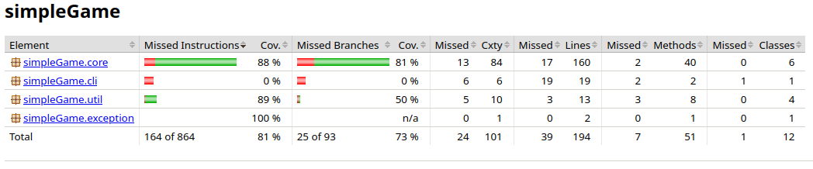
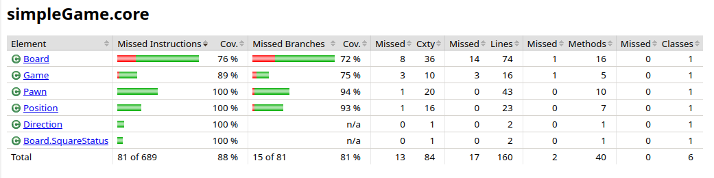
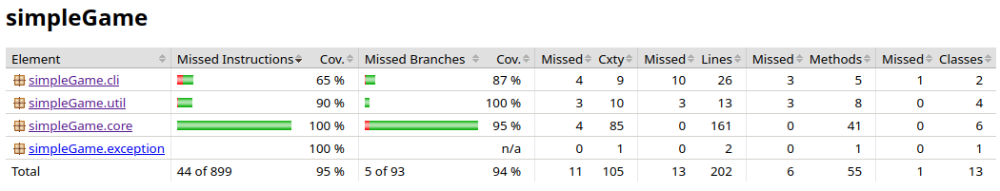
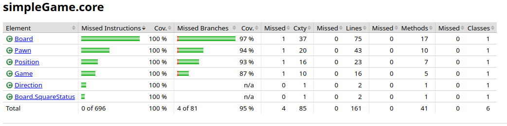
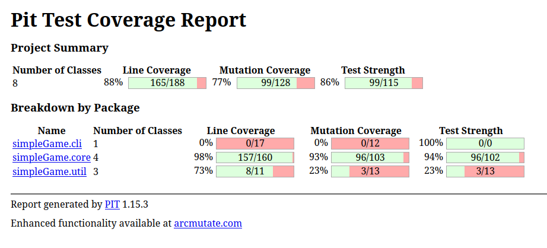
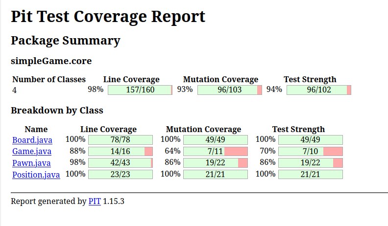
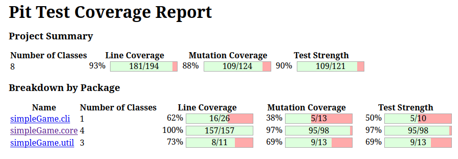
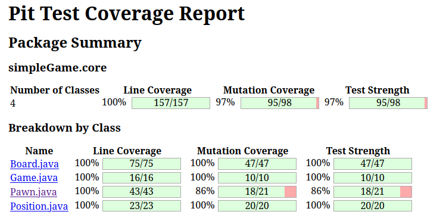

= SIMPLE GAME - TEST REVIEW

_Besher AL ADDAM, Anis AIT YACOUB & Mattéo DERANSART_

== Analyse de la testabilité

=== Les différentes classes

- La classe main: +
Cette classe est difficile à tester. En l'état, elle prend en entrée des saisies utilisateurs pour fonctionner. Il va donc être difficile de tester notre programme sans mocker les entrées

- La classe Pawn: +
La classe Pawn possède des attributs privés, mais ceux ci sont tous accessibles facilement depuis des getters, a l'exception près des *hitpoints*.
Il faudra aussi s'assurer que la classe Board qu'elle utilise sera bien testée.
En conséquent, il sera plutot facile de tester toutes les méthodes de cette classe en rajoutant le bon getter.

- La classe Position: +
La classe position ne possède que deux attributs : *x* et *y*. Ceux ci sont accessibles par des getters. La classe est donc très facilement testable

- La classe Direction: +
Cette classe est juste un enum. Il n'est pas nécessaire de la tester.

- La classe Board: +

== Application d'une méthode fonctionnelle

== Application d'une méthode structurelle

== Couverture de code avec Jacoco

=== Première évaluation

Voici la première couverture de code réalisée avec Jacoco:

81% de couverture de code au niveau global!
Nous n'avons testé que le module core à ce moment-là, mais il nous as semblé avoir fait la plus grosse partie du travail.

Nous allons devoir revoir les tests de Board et de Game qui se révèlent être insuffisants. Nous sommes pourtant assez satisfait en ce qui concerne les autres classes 

La couverture de tests n'est pas encore suffisante, nous allons devoir améliorer celà

=== Deuxième évaluation

Voici la version finale de l'évaluation de notre couverture de code:

Nous avons écris quelques tests pour le module util entre temps, mais ne sommes pas allés jusqu'à 100% de couverture de test. Certaines méthodes comme la méhode main étaient tout simplement trop difficile à tester.

Nous avons atteint 100% de couverture de code pour le module core! C'était notre objectif de départ et nous l'avons fait.

Nous sommes satisfait de notre couverture de code.
Si nous ne sommes pas à 100% de couverture de code sur l'ensemble du logiciel, nous considérons toutefois que c'est suffisant pour notre application.

Naivement, nous faisont confiance à ce moment la au module utils (que nous déciderons de tester plus tard, comme expliqué dans le point suivant).

Comme nous l'avons vu dans l'analyse de testabilité, le module cli quand à lui, est difficilement testable. Nous considérons qu'il est du travail du testeur "manuel" de vérifier son bon fonctionnement

== Analyse de mutation avec PIT

=== Première évaluation

La première fois que nous avons utilisé PIT à été le moment ou nous avons réalisé que nous gagnerions à tester les autres modules:

En effet, si le code du module core était plutot bien testé, rien ne nous prouve que le reste du programme fonctionne correctement.

Puisque nous concentrons nos efforts sur le module core, il nous as semblé important de s'assurer que nos tests couvraient bien tout notre code.
Dans notre cas, notre couverture de test laisse passer certains mutants, nous nous sommes alors décidés à améliorer nos tests

Les analyses ci-dessus nous ont prouvé que nous avions encore un peu de chemin à faire avant de considérer nos tests comme suffisants.

=== Evaluation Finale

Nous avons bien amélioré notre résistance aux mutants. de 88%, nous sommes passés à 93% de résistance aux mutants.

Tester une partie du module util nous as permis d'améliorer grandement ce score.

Nous avons amélioré nos tests sur le module core pour qu'ils puissent s'adapter à un plus grand nombre de mutants.
Toutefois, nos tests ne survivent pas à certaines mutations qui prennent toutes la forme suivante:

[red]#1. removed call to simpleGame/util/Logger::log → SURVIVED#

Ces mutations suppriment certains logs, et puisqu'on ne détecte pas si un log à été affiché, le mutant n'est pas rattrapé.
Toutefois, nous considérons ces mutants comme bénins, et décidons de passer outre.

== Conclusion

En ayant passé en revue toutes les lignes de notre code non couvertes et/ou non-résilientes aux mutants, nous avons pu classer ces dernières dans deux catégories: +
    - Les instructions systemes: Nous pourrions vérifier qu'une fonction appelle bien les appels qu'elle dis appeller, mais celà nous as semblé assez peu utile. +
    - Les instructions néccessitant des entrées utilisateur: nous aurions pu mocker ces opérations, mais il nous as semblé peu interessant de le faire

Nous considérons que le travail de test automatisé est fini à ce stade.
Viens maintenant la phase ou nous devons tester manuellement le programme pour vérifier qu'il fonctionne bien.
Certes ces tests ne sont pas parfais, la preuve en est que nous avons trouvé un dernier bug en lancant la partie manuellement:

Les cases bonus ne s'affichaient que 3 fois sur 4. Il a été facile de localiser le problème, mais nos suites de tests ont du aussi être modifiées en conséquences.

Toutefois ces tests n'ont pas été inutile et nous ont permis de trouver des erreurs dans le code que nous n'aurions jamais pensé trouver autrement.

Les deux approches sont complémentaires