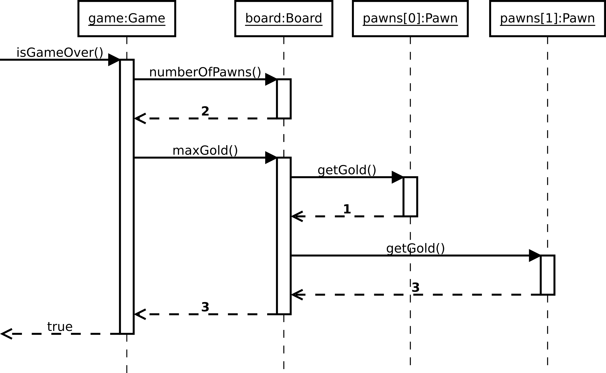

:sectnums:

== A very simple game

=== Introduction

A very trivial video game with a textual interface, where two ``pawns'' have to fight by moving on the squares of a board. Written in Java.

=== Rules of the game

* The setting is a rectangular board, divided in X × Y squares, with one ``bonus'' square, and with N pawns distributed over the board
* Each pawn has a number, and turns are based on the order of the numbers (e.g. 0 plays first, then 1 plays, then 2 plays, etc.)
* Each turn, a pawn moves in a direction (up, down, left, right). There are two special cases:
** It encounters a pawn. In that case, it attacks the pawn and hurts it
** It tries to go out of the board, and loses its turn
* When attacking, a pawn normally inflicts 1 damage to another pawn. However, it inflicts twice the amount if it is on the ``bonus'' square. If a pawn kills another one, it earns 1 gold.
* A pawn has 5 hitpoints
* The game is over either when there is 1 pawn left, either when a pawn has 3 golds.

=== Compiling and running the game

Builds are managed using _maven_. To compile simply run:

....
mvn package
....

Then to run the game:

....
java -jar target/simpleGame-1.jar
....

The game then starts, and shows you a board with both Pawns and the special square. A Pawn is either shown as a single letter (`A` or `B`), and is colored in blue when it is its turn (or green when the Pawn is on the special square). The special square is shown as a yellow `#`.

You can type a number between 0 and 3 on your keyboard to select the direction you want the current pawn to pick, and then validate this choice with your return key.

=== Informations for developers

==== Organisation of the code

* `simplegame.cli`: Package with the user interface and the main method.
** `CLIMain`: The main class, to play the game with a console interface.
* `simplegame.core`: Package with the main classes.
** `Board Class`: that describes the board.
** `Direction`: Enumeration of the directions a Pawn can follow.
** `Game`: Class to initialize and interact with the game.
** `Pawn`: Class that describes the state and behavior of a Pawn.
* `simplegame.exception`: Package with the exceptions used.
** `OutOfBoardException`: Sent when a Pawn tries to leave the board.

==== Specification of `isGameOver`

The method `isGameOver` is supposed to go over the different pawns, find whether one has three gold, and return true if that is the case. This means that the following scenario should work:

