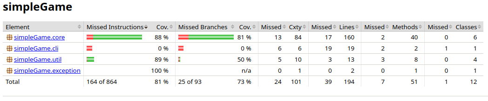
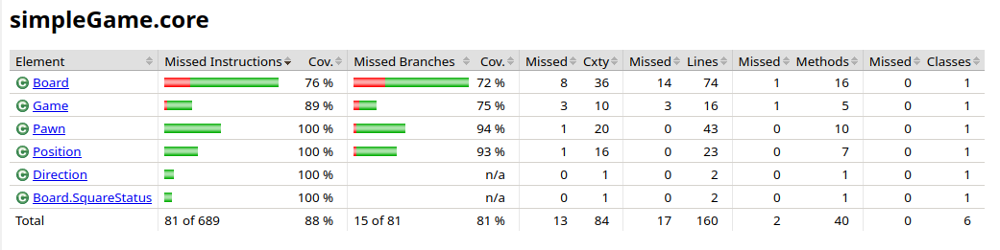
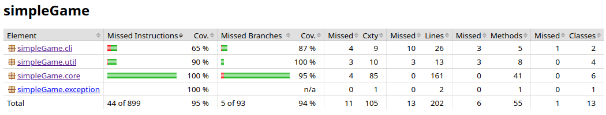
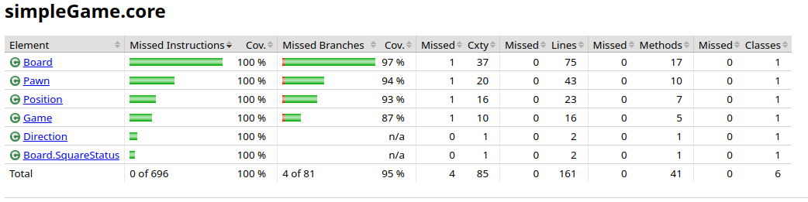
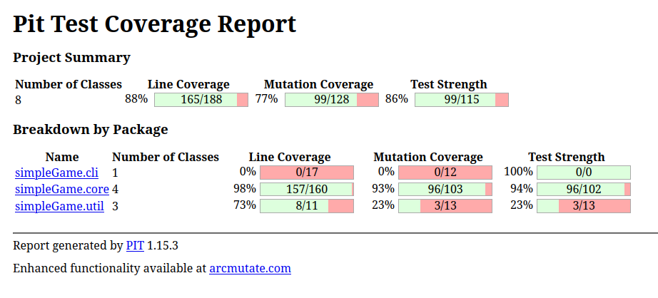
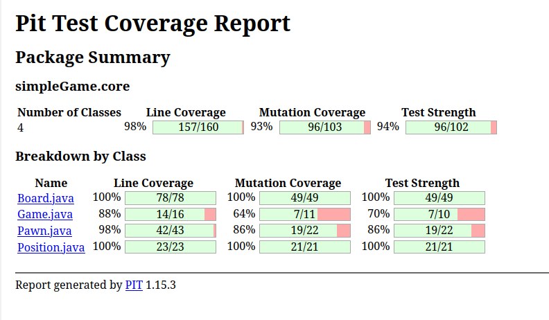
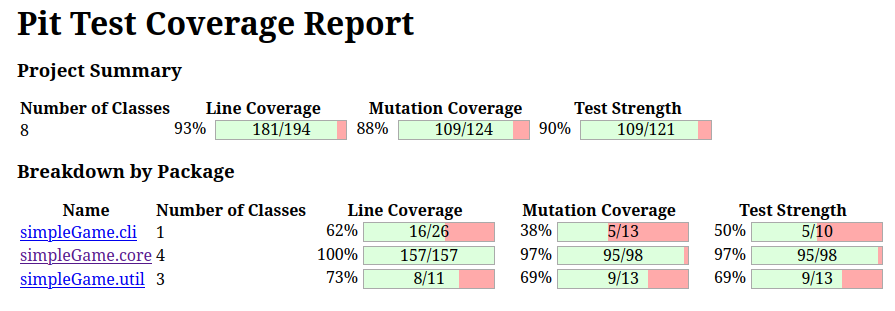
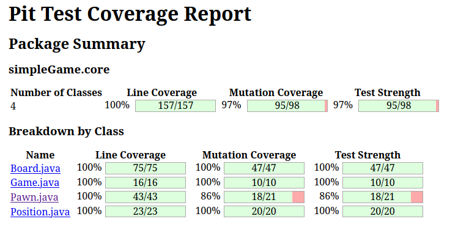

= Rapport Projet Test Logiciel
:toc:
:sectnums:

== Projet M1 Alma 2023-24 : +
AL ADDAM Besher +
AIT YACOUB Anis +
DERANSART Mattéo

== Analyse de la Testabilité

=== Gestion de l'État et Dépendances

* _Classe Board_ : Gère un état complexe et interagit avec `Pawn` et `Position`.

=== Complexité des Méthodes et Scénarios de Test

* _Méthodes clés_ : `addPawn`, `removePawn`, `newTurn`, `getStatusOfSquare` demandent des tests approfondis pour couvrir tous les cas possibles.

=== Aléatoire dans l'Initialisation

* _Initialisation aléatoire_ : Des tests bien conçus sont nécessaires pour gérer les différentes configurations initiales ou contrôler l'aléatoire.

=== Visualisation et Représentation

* _Tests des représentations_ : Vérification que `squareContentSprite` et `toString` reflètent exactement l'état du plateau.

=== Structure et Fonctionnalités de l'Énumération Direction

==== Simplicité

* _Direction_ : Énumération Java standard avec quatre valeurs. Simplicité garantissant une testabilité élevée.

==== Utilisation dans le Système

* _Intégration_ : Direction est utilisée pour le mouvement des pions, facilitant son intégration dans les tests unitaires ou d'intégration.

=== Analyse de la Testabilité de Direction

==== Pas de Logique Interne

* _Simplicité_ : Pas de logique ou méthodes internes à tester.

==== Fiabilité et Consistance

* _Stabilité_ : Les valeurs de Direction restent inchangées, utilisables de manière prévisible.

==== Utilisation dans D'autres Classes

* _Focus_ : La testabilité de Direction réside dans son utilisation correcte dans d'autres classes.

=== Conclusion sur Direction

* _Tests spécifiques_ : Non nécessaires. Focus sur l'utilisation correcte dans le système.

=== Structure et Fonctionnalités de la Classe Game

==== Attributs et Constructeur

* _Attributs_ : `board` représente le plateau de jeu.
* _Constructeur_ : Initialise un Board avec paramètres prédéfinis, y compris position aléatoire du bonus.

==== Méthodes

* `isGameOver()`, `toString()`, `playRound(Direction direction)` : Complexité et tests spécifiques nécessaires.

=== Analyse de la Testabilité de Game

==== Dépendances et Complexité

* _Dépendances_ : Game dépend de Board et Pawn.
* _Méthode `playRound`_ : Nécessité de couvrir divers scénarios.

==== Gestion des Exceptions et Aléatoire

* _Exceptions_ : Importantes à tester dans `playRound`.
* _Aléatoire_ : Impact sur les tests dus à la variabilité.

=== Structure et Fonctionnalités de la Classe Pawn

==== Attributs, Constructeur et Méthodes

* _Attributs et Accesseurs_ : `position`, `board`, `hitpoints`, `gold`, `letter`.
* _Constructeur_ : Facilite la configuration pour les tests.
* _Méthodes de Comportement_ : `move(Position p)`, `suffer(int i)`, `isDead()`, `attack(Position p)`.

=== Analyse de la Testabilité de Pawn

==== Dépendances et Complexité

* _Dépendances_ : Fortes avec Board et Position.
* _Méthodes_ : Logique conditionnelle complexe.

==== Gestion des Exceptions et Effets Latéraux

* _Exceptions_ : Importantes à tester dans `move` et `attack`.
* _Effets Latéraux_ : Vérification des changements d'état et interactions.

=== Conclusion sur Pawn

* _Challenges_ : Testabilité impactée par les dépendances et la complexité.
* _Approche_ : Tests unitaires avec mocking et tests d'intégration nécessaires.

=== Structure et Fonctionnalités de la Classe Position

==== Attributs Privés et Méthodes d'Accès

* _Attributs_ : `x` et `y` avec méthodes d'accès `getX()` et `getY()`.

==== Constructeur et Méthodes

* _Constructeur_ : Initialise avec les paramètres `x` et `y`.
* _Méthodes_ : `copy()`, `getPositionNextTo(Direction d)`, `isNextTo(Position otherPosition)`, `equals(Object other)`.

=== Conclusion sur Position

* _Testabilité_ : Excellente grâce à ses méthodes bien conçues et à ses attributs privés.
* _Robustesse_ : Modifications apportées renforcent la testabilité.

== Méthode Fonctionnel

=== Méthode 1 : Pawn::attack(Position p)
    ** Domaines :
        * Entrée :
            - this.getPosition() ∈ Position
            - this.board ∈ Board
            - p ∈ Position
        * Sortie :
            - this ∈ Pawn
            - ImpossibleActionException
        ** Caractéristiques :
            * C1: this.position.isNextTo(p)
            * C2: this.board.getSquareContent(p)
            * C3: Position p est null
            * C4: this.board.isBonusSquare(this.position)
        ** Combinaisons de choix avec le critère Multiple Base Choice Coverage :
            * Combinaisons de base définies comme C1B;C2B;C3B;C4A et C1B;C2B;C3B;C4B
            * Doublon identifié pour la combinaison C1B;C2B;C3B;C4A
            * Combinaisons finales dérivées :

=== Tableau des Combinaisons de Choix :
|===
| Combinaison | this.position.isNextTo(p) | this.board.getSquareContent(p) | p | this.board.isBonusSquare(this.position) | ennemi.getHitpoints() | Oracle
| C1B;C2B;C3B;C4A | vrai | vrai | vrai | faux | 2 | !this.board.isBonusSquare(this.position) && getGold() == 0
| C1B;C2B;C3B;C4B | vrai | vrai | vrai | vrai | 2 | this.board.isBonusSquare(this.position) && getGold() == 1
| C1A;C2B;C3B;C4A | faux | vrai | vrai | faux | 6 | ImpossibleActionException
| C1B;C2A;C3B;C4A | vrai | faux | vrai | faux | - | ImpossibleActionException
| C1B;C2B;C3A;C4B | vrai | vrai | faux | vrai | 6 | ImpossibleActionException
| C1A;C2B;C3B;C4B | faux | faux | faux | faux | - | ImpossibleActionException
| C1B;C2A;C3B;C4B | faux | vrai | faux | faux | 6 | ImpossibleActionException
|===

=== Méthode 2 : Game::playRound(Direction direction)
    ** Domaines :
        * Entrée :
            - direction ∈ Direction
            - this.board ∈ Board
            - currentPawn ∈ Pawn
        * Sortie :
            - this.board ∈ Board
            - currentPawn ∈ Pawn
            - ImpossibleActionException
        ** Caractéristiques :
            * C1: this.board.getStatusOfSquare(nextPosition)
            * C2: direction est valide
            * C3: action (move ou attack) est possible
        ** Combinaisons de choix avec le critère Multiple Base Choice Coverage :
            * Combinaisons de base définies comme C1A;C2A;C3A, C1B;C2A;C3B, et C1C;C2B;C3A
            * Combinaisons finales dérivées :

=== Tableau des Combinaisons de Choix :
|===
| Combinaison | Statut de la Case | Direction Valide | Action Possible | Oracle
| C1A;C2A;C3A | OCCUPIED | Vrai | Vrai | currentPawn.attack(nextPosition)
| C1B;C2A;C3A | EMPTY | Vrai | Vrai | currentPawn.move(nextPosition)
| C1C;C2A;C3B | OUT_OF_BOARD | Vrai | Faux | ImpossibleActionException
| C1A;C2B;C3A | OCCUPIED | Faux | Vrai | ImpossibleActionException
| C1B;C2B;C3A | EMPTY | Faux | Vrai | ImpossibleActionException
| C1C;C2B;C3B | OUT_OF_BOARD | Faux | Faux | ImpossibleActionException
|===

== Qualité des tests (a) : couverture du code
*Première évaluation*

Voici la première couverture de code réalisée avec Jacoco

81% de couverture de code au niveau global!
Nous n’avons testé que le module core à ce moment-là, mais il nous as semblé avoir fait la plus grosse partie du travail.

Nous allons devoir revoir les tests de Board et de Game qui se révèlent être insuffisants. Nous sommes pourtant assez satisfait en ce qui concerne les autres classes

La couverture de tests n’est pas encore suffisante, nous allons devoir améliorer celà

*Deuxième évaluation*

Voici la version finale de l’évaluation de notre couverture de code:

Nous avons écris quelques tests pour le module util entre temps, mais ne sommes pas allés jusqu’à 100% de couverture de test. Certaines méthodes comme la méhode main étaient tout simplement trop difficile à tester.

Nous avons atteint 100% de couverture de code pour le module core! C’était notre objectif de départ et nous l’avons fait.

*Pensez-vous que votre suite de test soit suffisante ?*

Nous sommes globalement satisfaits de la couverture de code de notre application, bien qu'elle ne soit pas à 100%. Nous estimons que le niveau actuel n'est pas suffisant, car nous n'avons pas atteint un niveau de 95% sur toutes les branches.

== Analyse de mutation avec PIT
*Premiere Evaluation*

Notre première utilisation de PIT a été un moment révélateur, mettant en lumière l'importance de tester les autres modules de notre programme. Bien que le module core ait été relativement bien testé, cette expérience a souligné que cela ne garantissait pas la fiabilité du reste du programme.

Concentrant nos efforts sur le module core, il était crucial pour nous de vérifier que nos tests couvraient efficacement l'ensemble de notre code. Face à certains mutants non détectés par notre couverture de tests actuelle, nous avons pris la décision d'affiner et d'améliorer nos tests pour assurer une meilleure couverture et fiabilité.

Les analyses ci-dessus nous ont prouvé que nous avions encore un peu de chemin à faire avant de considérer nos tests comme suffisants.

*Evaluation Finale*

Nous avons bien amélioré notre résistance aux mutants. de 88%, nous sommes passés à 93% de résistance aux mutants.

Tester une partie du module util nous as permis d’améliorer grandement ce score.

Nous avons optimisé nos tests sur le module core pour qu'ils puissent gérer davantage de mutants. Cependant, certains mutants survivent, notamment ceux qui suppriment les appels au log dans simpleGame/util/Logger::log. Ces mutations ne sont pas détectées car nos tests ne vérifient pas l'affichage des logs.

== Bugs découvert:
|===
|Classe |Défaut
|Game::playRound
|Il manque un break dans le switch
|Board::Board
|Parfois (mais pas tout le temps), une erreur était relevé sur la méthode testNumberOfPawns. La raison est que le constructeur faisait une boucle for aléatoirement sur le nombre de pions à initialiser.

Dans ces cas la il pouvais écraser un ou plusieur pion, ce qui fait qu'il y avait moins de pion que souhaité sur le plateau.

Nous avons donc changé la boucle for en boucle while
|Board::Board
|La case bonus était initialisé avec des valeurs de 1 à n et pas de 0 à n-1
|Board::Board
|Le contructeur incrémente le charactère du pion: A deviens B.
|
|Board::GetStatusOfSquare
| Dans la condition suivante, les cases testées à n+1 sont toujours considérées comme étant dans le tableau. +
"if (y <= this.getYSize() && x <= this.getXSize() && y >= 0 && x >= 0)"

On change la condition pour que la logueur parcourue soit strictement inférieure à la taille du tableau
|Position::isNextTo
|Dans la condition initale, on testais si une position était adjascent en x et adjascent en y. La zone pour laquelle la méthode renvoie true est donc assimilable à une croix qui parcours toute la board.

Pour que la condition se rapproche de ce qui est demandé dans la spec, on a utilisé un XOR plutôt qu'un AND
|Pawn::Pawn
|Les hitpoints initiaux étaient configurés à 2 au lieu de 6 comme marqué dans la spec
|Pawn::isDead
|Un pion doit mourir si il à des points de vie strictement inférieur à 0. Non pas égal à 0 car les hitspoints peuvent être négatifs
|GameColor
|La valeur de l'enum PURPLE dois être MAGENTA
|===

== Conclusion
Après avoir terminé ce projet de test logiciel, nous avons compris l'importance de tests bien conçus. L'utilisation de JaCoCo et Pitest, ainsi que des mocks, a été essentielle pour identifier des problèmes de conception. Maintenant, nous voyons clairement pourquoi il est crucial d'intégrer les tests dès le début du développement pour assurer la qualité et la fiabilité du logiciel.
